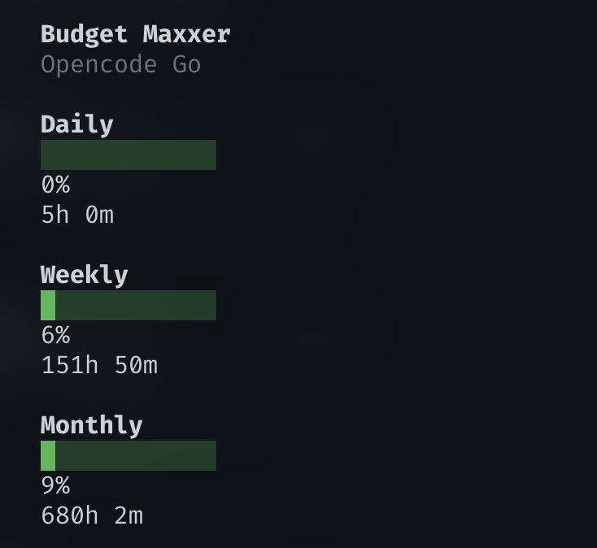
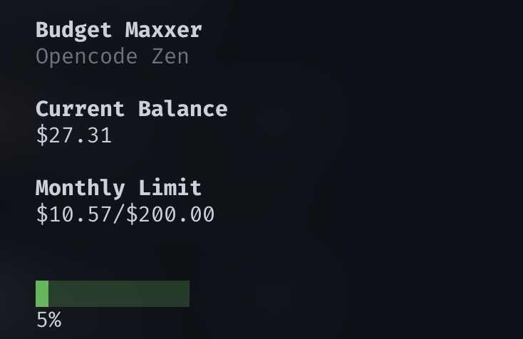
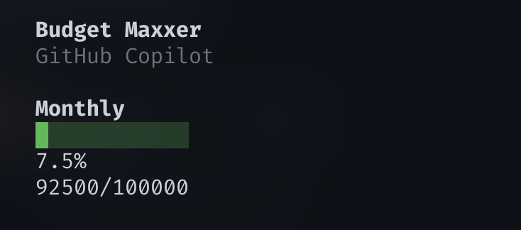

# opencode-budget-maxxer

Surface provider usage limits and quota data for OpenCode and GitHub Copilot backends, displayed in the TUI sidebar with per-session provider override.

## Features

- **Provider quota display** — Shows remaining usage limits for OpenCode Go, OpenCode Zen, and GitHub Copilot
- **Per-session tracking** — Each session independently tracks which provider's quota to display
- **Manual override** — Switch the sidebar to show any provider regardless of the active model via `/budget:show`
- **Auto-follow** — Default mode follows the active model in each session
- **TUI sidebar meter** — Visual budget meter with provider name, usage bar, and reset time
- **Three built-in providers** — Go, Zen, and Copilot with auth resolution and API polling

## Demo

<p align="center">
  
  <br />
  <em>OpenCode Go</em>
</p>

<p align="center">
  
  <br />
  <em>OpenCode Zen</em>
</p>

<p align="center">
  
  <br />
  <em>GitHub Copilot</em>
</p>

## Installation

For end users who want to use the plugin in their OpenCode setup.

### Quick Install (Recommended)

```bash
bash <(curl -s https://raw.githubusercontent.com/mjyocca/opencode-budget-maxxer/main/scripts/install.sh)
```

This script:
- Clones the plugin into OpenCode's global plugins directory
- Installs dependencies and builds the plugin
- Registers the TUI plugin in your config
- Works on macOS, Linux, and Windows

### Manual Install

```bash
# 1. Clone into plugin directory
git clone https://github.com/mjyocca/opencode-budget-maxxer.git \
  ~/.config/opencode/plugins/opencode-budget-maxxer

# 2. Install dependencies and build
cd ~/.config/opencode/plugins/opencode-budget-maxxer
pnpm install
pnpm build

# 3. Register TUI plugin
pnpm plugin:install
```

**Note:** On macOS, use `~/Library/Application Support/opencode/plugins/opencode-budget-maxxer` instead.

### Updating

```bash
cd ~/.config/opencode/plugins/opencode-budget-maxxer
git pull
pnpm install
pnpm build
```

### Uninstalling

```bash
# From the plugin directory
pnpm plugin:uninstall

# Then remove the directory
rm -rf ~/.config/opencode/plugins/opencode-budget-maxxer
```

Or use the uninstall script:

```bash
bash <(curl -s https://raw.githubusercontent.com/mjyocca/opencode-budget-maxxer/main/scripts/uninstall.sh)
```

### After Installation

Restart OpenCode to activate the plugin. The budget meter will appear in the sidebar once a session is active. Use `/budget:show` to switch providers.

---

## Development

For developers who want to contribute to or modify the plugin.

### Prerequisites

- Node.js >= 20.0.0
- pnpm >= 10.0.0
- Git

### Getting Started

1. **Clone the repository:**
   ```bash
   git clone https://github.com/mjyocca/opencode-budget-maxxer.git
   cd opencode-budget-maxxer
   ```

2. **Install dependencies:**
   ```bash
   pnpm install
   ```

3. **Build the plugin:**
   ```bash
   pnpm build
   ```

4. **Set up local environment:**
   
   Copy the example environment file:
   ```bash
   cp .env.local.example .env.local
   ```
   
   Or set the environment variable directly:
   ```bash
   export OPENCODE_CONFIG_CONTENT='{"plugin":["./dist/index.js"]}'
   ```
   
   This tells OpenCode to load the server plugin from your local workspace using a relative path.

5. **Register TUI plugin:**
   ```bash
   pnpm dev:install
   ```
   
   This adds your workspace to `~/.config/opencode/tui.json` so the TUI plugin loads from your local build.

6. **Start OpenCode:**
   
   Launch OpenCode from the plugin directory. The budget meter should appear in the sidebar.

### Development Workflow

```bash
# Watch mode for server plugin (auto-rebuilds on changes)
pnpm dev

# Rebuild TUI plugin (must be done manually after changes to src/tui.tsx)
pnpm build

# Type-check without emitting
pnpm build:check

# Run tests
pnpm test
```

After making changes:
1. For server plugin (`src/index.ts`, `src/providers/`, etc.): Changes are auto-rebuilt in watch mode. Restart OpenCode to pick up changes.
2. For TUI plugin (`src/tui.tsx`): Run `pnpm build` to copy the file to `dist/`, then restart OpenCode.

### Local Development Scripts

| Script | Description |
|--------|-------------|
| `pnpm dev:install` | Register TUI plugin for local development |
| `pnpm dev:uninstall` | Unregister TUI plugin |
| `pnpm build` | Build both server and TUI plugins |
| `pnpm dev` | Watch mode (server only) |
| `pnpm build:check` | Type-check without emitting |
| `pnpm test` | Run test suite |
| `pnpm test:watch` | Run tests in watch mode |

### Debugging

Enable debug logging:
```bash
export OPENCODE_LOG_LEVEL=DEBUG
export OPENCODE_PRINT_LOGS=1
```

Then filter logs:
```bash
opencode 2>&1 | grep "budget-maxxer"
```

Or use the debug script:
```bash
pnpm debug
```

### Project Structure

```
opencode-budget-maxxer/
├── src/
│   ├── index.ts          # Server plugin — hooks, tools, chat.headers
│   ├── tui.tsx           # TUI plugin — sidebar slot, /budget:show command
│   ├── cache.ts          # Per-session quota cache, mutex, provider alias mapping
│   ├── lib/              # Shared utilities (HTTP, auth, config, hooks)
│   └── providers/        # Provider implementations (Go, Zen, Copilot)
├── tests/                # Test suite
├── scripts/              # Build and installation scripts
├── dist/                 # Build output
└── docs/                 # Documentation and images
```

### Key Design Decisions

- **One-way dependency arrow**: `index.ts` → `providers/` → `lib/`
- **Mutex-protected cache**: All cache read-modify-write operations serialized
- **Provider ID aliases**: `mapProviderID()` normalizes provider IDs across opencode versions
- **Slot-driven session tracking**: `sidebar_content` slot props provide reliable session context
- **Per-session override**: `setSessionOverrideProvider()` stores user preference per session

---

## Architecture

```
src/
├── index.ts                  # Server plugin — hooks, tools, chat.headers
├── tui.tsx                   # TUI plugin — sidebar slot, /budget:show command
├── cache.ts                  # Per-session quota cache with mutex, provider alias mapping
├── lib/
│   ├── core/                 # Constants, types
│   ├── http/                 # HTTP fetch wrapper, retry, errors
│   ├── auth/                 # Auth file reader, credential resolution
│   ├── provider/             # Provider result types, helpers
│   ├── hooks/                # Hook composition utilities
│   └── ...                   # Config discovery, runtime paths, mutex, etc.
└── providers/
    ├── opencode-go/          # Go provider — auth, API, adapter
    ├── opencode-zen/         # Zen provider — auth, API, adapter
    └── copilot/              # Copilot provider — auth, API, adapter
```

### Key Design Decisions

- **One-way dependency arrow**: `index.ts` → `providers/` → `lib/`
- **Mutex-protected cache**: All cache read-modify-write operations serialized
- **Provider ID aliases**: `mapProviderID()` normalizes provider IDs across opencode versions
- **Slot-driven session tracking**: `sidebar_content` slot props provide reliable session context
- **Per-session override**: `setSessionOverrideProvider()` stores user preference per session

---

## Exports

| Export Path | File | Purpose |
|-------------|------|---------|
| `.` | `dist/index.js` | Server plugin (default) |
| `./server` | `dist/index.js` | Server plugin (explicit) |
| `./tui` | `dist/tui.tsx` | TUI plugin (raw TSX) |

---

## License

MIT
